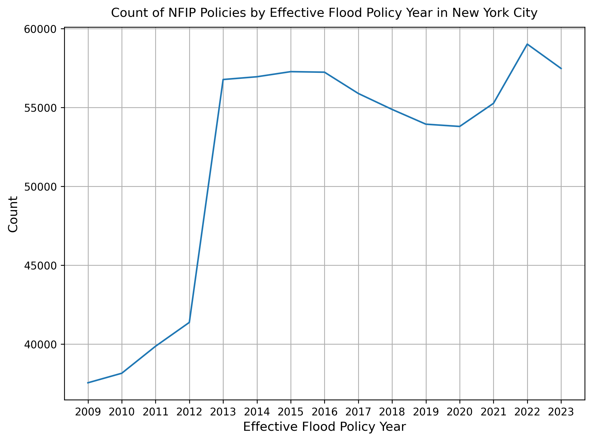

# National Flood Insurance Program (NFIP) Data for New York City
Author: Mark Bauer

## Table of Contents
   * [1. About the Project](#1-About-the-Project)
   * [2. OpenFEMA API Documentation](#2-OpenFEMA-API-Documentation)
   * [3. Additional Resources](#3-Additional-Resources)
   * [4. Say Hello](#4-Say-Hello)

  

  

## 1. About the Project
National Flood Insurance Program (NFIP) Data for New York City using Python. Work in progress.

## 2. OpenFEMA API Documentation
* [OpenFEMA](https://www.fema.gov/about/reports-and-data/openfema)
* The [OpenFEMA API Documentation](https://www.fema.gov/about/openfema/api)
* The [National Flood Insurance Program (NFIP)](https://www.fema.gov/about/openfema/data-sets#nfip) Dataset
* [Code Examples](https://github.com/FEMA/openfema-samples) on GitHub

## 3. Additional Resources
* [National Flood Insurance Program](https://nfipservices.floodsmart.gov/)
* [Flood Insurance Data and Analytics](https://nfipservices.floodsmart.gov/reports-flood-insurance-data)

## 4. Say Hello!
Contact information:  
Twitter: [markbauerwater](https://twitter.com/markbauerwater)   
LinkedIn: [markebauer](https://www.linkedin.com/in/markebauer/)  
GitHub: [mebauer](https://github.com/mebauer)
