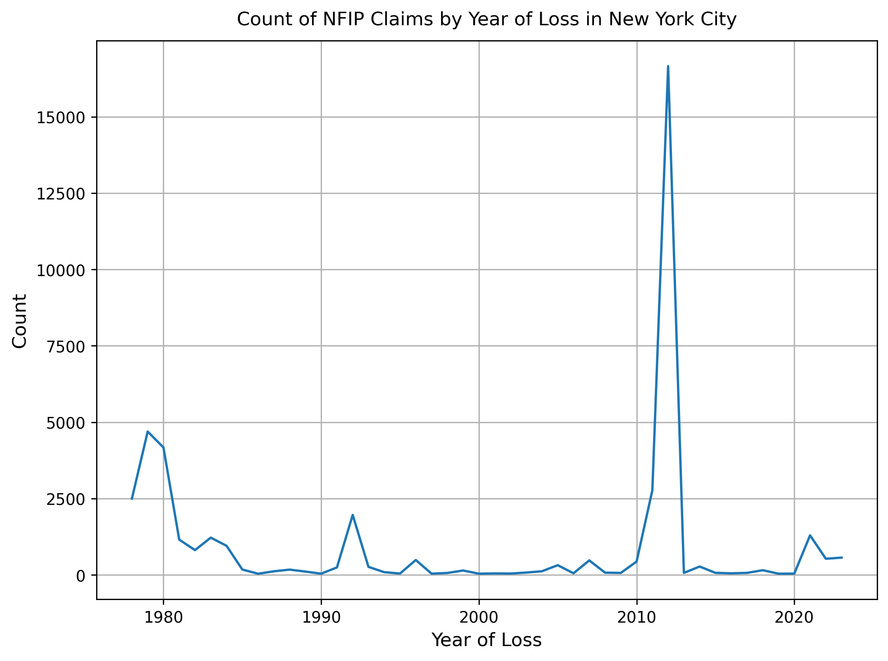
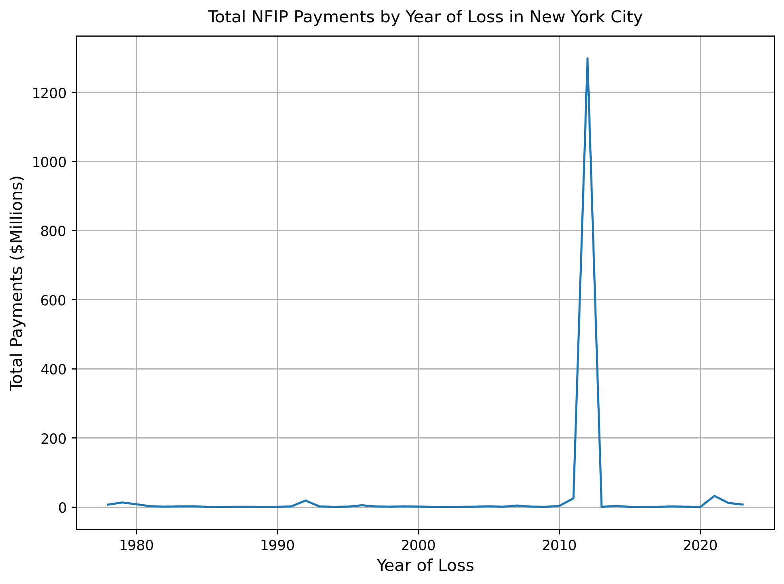

# Exploring National Flood Insurance Program (NFIP) Data for New York City
Author: Mark Bauer

## Table of Contents
   * [1. About the Project](#1-About-the-Project)
   * [2. OpenFEMA API Documentation](#2-OpenFEMA-API-Documentation)
   * [3. Additional Resources](#3-Additional-Resources)
   * [4. Say Hello](#4-Say-Hello)

  

  

## 1. About the Project
This project explores the National Flood Insurance Program (NFIP) Data for New York City using the [OpenFEMA API](https://www.fema.gov/about/openfema/ap) and the [Python programming language](https://www.python.org/). This project includes three notebooks:
* [data-wrangling.ipynb](https://github.com/mebauer/fema-nfip-nyc/blob/master/data-wrangling.ipynb): How to download NFIP data from the OpenFEMA API.
* [sample-analysis-policies.ipynb](https://github.com/mebauer/fema-nfip-nyc/blob/master/sample-analysis-policies.ipynb): Sample plots and visualizations for NFIP policies.
* [sample-analysis-claims.ipynb](https://github.com/mebauer/fema-nfip-nyc/blob/master/sample-analysis-claims.ipynb): Sample plots and visualizations for NFIP claims.

## 2. OpenFEMA API Documentation
* [OpenFEMA](https://www.fema.gov/about/reports-and-data/openfema): The public’s resource for FEMA program data. Promoting a culture of Open Government and increasing transparency, participation, and collaboration among the Whole Community in support of FEMA's mission to help people before, during, and after disasters.
* The [OpenFEMA API Documentation](https://www.fema.gov/about/openfema/api)
* The [National Flood Insurance Program (NFIP)](https://www.fema.gov/about/openfema/data-sets#nfip) Dataset on OpenFEMA
* [Code Examples](https://github.com/FEMA/openfema-samples) on GitHub

## 3. Additional Resources
* [National Flood Insurance Program](https://nfipservices.floodsmart.gov/): Official website for the National Flood Insurance Program
* [Flood Insurance Data and Analytics](https://nfipservices.floodsmart.gov/reports-flood-insurance-data): Visualizations, reports, and data elements of the National Flood Insurance Program to help educate the public about the impact of major flood events and flood risk across the nation.
* [FAQs about NFIP Data](https://nfipservices.floodsmart.gov/frequently-asked-questions-about-nfip-policies-and-claims-data)

## 4. Say Hello!
Contact information:    
LinkedIn: [markebauer](https://www.linkedin.com/in/markebauer/)  
Twitter: [markbauerwater](https://twitter.com/markbauerwater)  
GitHub: [mebauer](https://github.com/mebauer)
