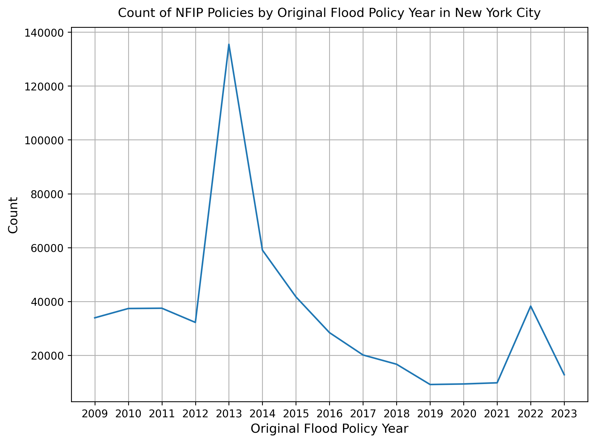
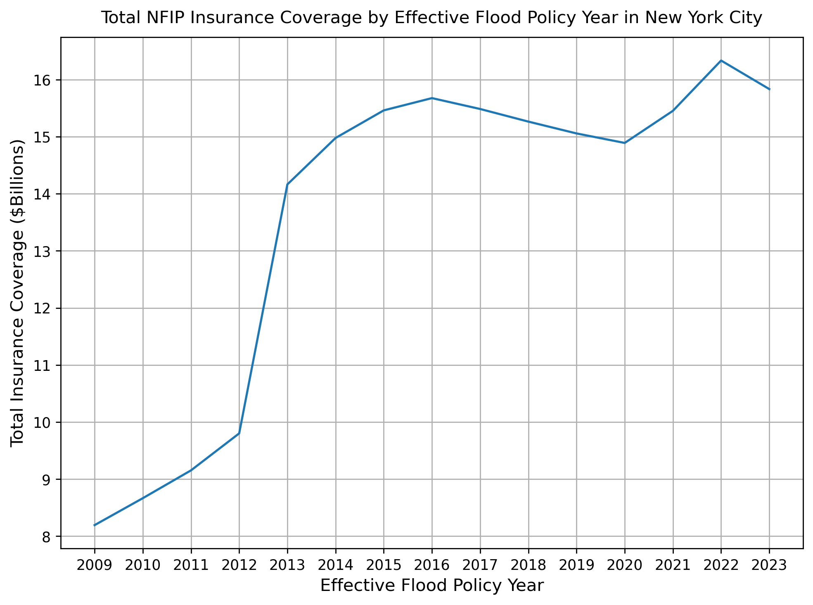

# National Flood Insurance Program Data for New York City
Author: Mark Bauer

  

  

## About the Project
National Flood Insurance Program (NFIP) Data for New York City using Python. Work in progress.

## Say Hello!
Contact information:  
Twitter: [markbauerwater](https://twitter.com/markbauerwater)   
LinkedIn: [markebauer](https://www.linkedin.com/in/markebauer/)  
GitHub: [mebauer](https://github.com/mebauer)
